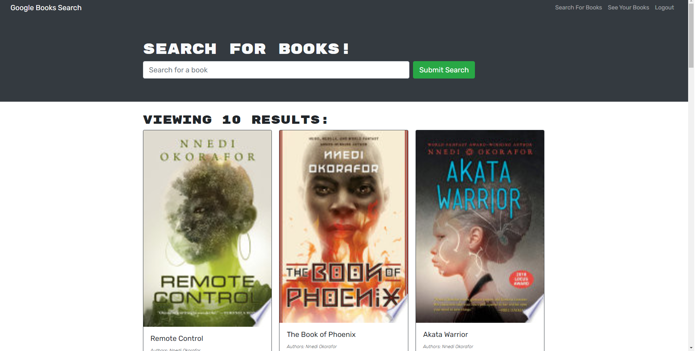
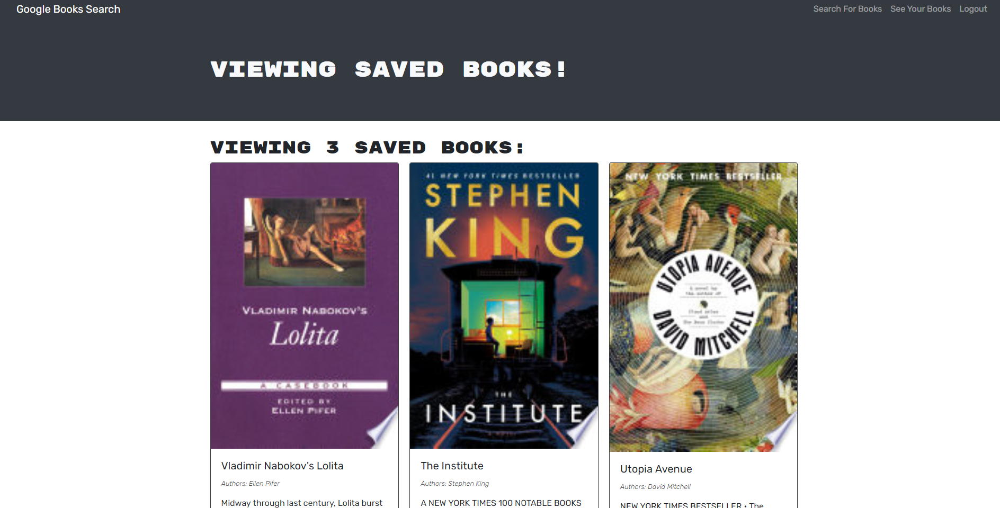

# Book Search Engine
## Description
A MERN stack book search engine utilizing GraphQL for queries and mutations.
## Built With
* React
* GraphQL
* MongoDB
* Express
* Node.js
* JSON Web Tokens
## Live Application
https://peaceful-harbor-66124.herokuapp.com/
## Preview

## Questions
If you have any further questions about this application / repository feel free to contact me at: 
* [GitHub](https://github.com/jpkashlak)
* E-Mail: jpkashlak@gmail.com
